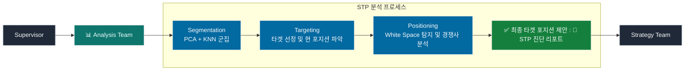
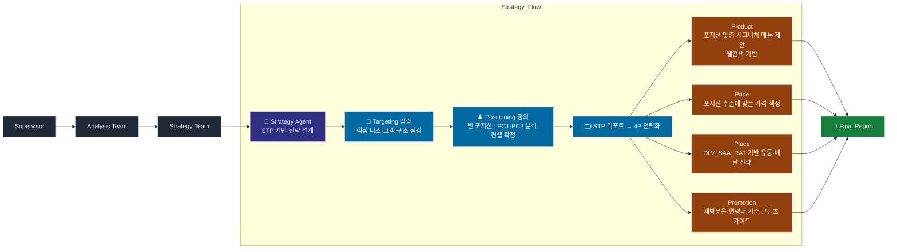
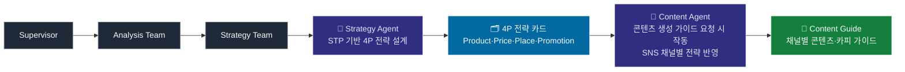

# 🤖[장사친구 마케팅 에이전트] Marketing MultiAgent System

> [프로젝트 한 줄 소개 / AI 핵심 기능 요약]
> Google Gemini와 LangGraph를 활용한 자율 마케팅 전략 수립 및 콘텐츠 생성 시스템

</br>

## 📌 프로젝트 개요

* **프로젝트명:** 장사친구 마케팅 에이전트
* **개발기간:** [YYYY.MM.DD] ~ [YYYY.MM.DD]
* **팀원 구성:** [총 4명]
* **🚀 데모 영상 / 실행 결과 (GIF):** [[Streamlit 실행 화면]](https://2025bigcon-bizfriends.streamlit.app/%EB%A7%88%EC%BC%80%ED%8C%85_AI_Agent)
* **🏆 발표자료 (pdf):** [[AI데이터활용분야_장사친구팀_발표자료]](https://github.com/shashamalone/2025_shcard_bigcontest/blob/main/AI%EB%8D%B0%EC%9D%B4%ED%84%B0%ED%99%9C%EC%9A%A9%EB%B6%84%EC%95%BC_%EC%9E%A5%EC%82%AC%EC%B9%9C%EA%B5%AC%ED%8C%80.pdf)
* **🤖 핵심 모델 (Core Model):** Google Gemini 2.5 flash
* **🛠️ 주요 기술 (Key Tech):** LangGraph, Streamlit, Tavily API

</br>

## 🎯 프로젝트 배경 및 목표

[이 AI 에이전트를 개발하게 된 계기나 해결하고자 하는 문제를 작성합니다.]
(예: 소상공인은 마케팅 전략 수립에 어려움을 겪습니다. 저희는...)
[AI를 통해 달성하고자 하는 구체적인 목표를 기술합니다.]
(예: 1. 시장 분석 자동화, 2. 상황별 맞춤 전술 즉각 제안, 3. 채널별 콘텐츠 초안 생성)

</br>


## 🏗️ 시스템 아키텍처 (System Architecture)

본 시스템은 3가지 작업 유형을 지원하며, **Top-Level Supervisor** 에이전트가 사용자의 요청을 분석하여 최적의 워크플로우로 작업을 라우팅합니다.

### 1. 전체 워크플로우 (High-Level Workflow)


### 2. 에이전트 및 역할 (Agents & Roles)

#### 최상위 Supervisor

* **Top-Level Supervisor:** [사용자의 '작업 유형'에 따라 적절한 팀으로 라우팅하는 메인 컨트롤러]

```

사용자 입력
│
├─ 가맹점 선택
├─ 작업 유형 선택 (종합/상황/콘텐츠)
└─ 추가 정보 (상황/채널)
│
▼
Top-Level Supervisor (라우팅)
│
├─ [종합] → Analysis Team → Strategy Team → 보고서
├─ [상황] → Analysis Team → Situation Agent → Strategy Team → 전술
└─ [콘텐츠] → Analysis Team → Strategy Team → Content Agent → 가이드

```

#### 분석팀(Analysis Team)
* **Analysis Team:** [종합 전략 수립 :  시장과 환경을 분석]
- **STP 분석 (PCA 분석 + KNN 군집)**
    - **Segmentation**: 시장 군집(Cluster)별 특징 정의 + 가중치 기반 축 해석
    - **Targeting**: 타겟 군집(Cluster) 선정 및 가맹점의 현재 포지션{PC1, PC2} 좌표
    - **Positioning**: 매트릭스 상 빈 포지션(White Space)좌표 및 인근 경쟁사 군집 정보 => 최종 타겟 포지션 제안




#### 전략팀(Analysis Team)
* **Strategy Team:** [분석된 데이터를 기반으로 실제 4P 전략 및 전술 카드 생성]

* **Situation Agent:** [상황 전술 제안 : Tavily, Weather API 등 Tool을 사용하여 이벤트/날씨 등 특정 상황에 집중하여 기회 요소를 도출]

```mermaid
graph LR
    A[Supervisor] --> B[Analysis Team]
    B --> C[Strategy Team]

    C --> SA[🧭 Strategy Agent<br/>STP 기반 4P 전략 설계]
    SA --> STP4P[🗂️ 4P 전략 카드<br/>Product·Price·Place·Promotion]

    %% 사용자 요청: 상황 전술 제안
    STP4P --> SIT[🌦️ Situation Agent<br/>상황 전술 제안 요청 시 작동<br/>Tavily·Weather API 등 Tool 사용]

    SIT --> SP[📘 Situation Playbook<br/>이벤트·날씨 기반 전술 카드]
%% 스타일 정의
    classDef agent fill:#312e81,stroke:#e5e7eb,stroke-width:0.8px,color:#e0e7ff;
    classDef main  fill:#1f2937,stroke:#9ca3af,stroke-width:1px,color:#f9fafb;
    classDef node  fill:#0369a1,stroke:#e5e7eb,stroke-width:0.8px,color:#f9fafb;
    classDef output fill:#15803d,stroke-width:0.8px,stroke:#e5e7eb,color:#f9fafb;

    class A,B,C main;
    class SA,SIT agent;
    class STP4P node;
    class SP output;

```


* **Content Agent:** [콘텐츠 생성 가이드 :  확정된 전략을 바탕으로 SNS 채널별 콘텐츠 가이드 및 카피 생성]

</br>

## ⚙️ 핵심 기능 및 결과물 (Capabilities & Results)

[기존 '주요 기능' 섹션을 AI의 '작업 유형'별로 변경합니다. GIF 대신 'Input', 'Process', 'Output'을 명시하는 것이 더 명확합니다.]

### 1. 종합_전략_수립 📊
- 가맹점의 시장 환경을 분석하여 중장기적인 종합 마케팅 전략을 수립합니다.
* **Input:** [예: 가맹점 ID, 업종]
* **Process:** [예: Analysis Team과 Strategy Team이 협력하여 STP 분석 및 4P 전략 도출]
* **Output (예시):** [AI가 생성한 실제 '종합 컨설팅 보고서' 예시를 마크다운이나 이미지로 첨부]

> **[AI 생성 보고서 예시]**
>
> **1. 시장 분석 (Market Analysis)**
> * 주요 타겟 고객: 20대 여성, 직장인
> * ...
>
> **2. 4P 전략 (Strategy)**
> * Product: ...
> * Price: ...

### 2. 상황_전술_제안 ⚡

* **Input:** [예: 가맹점 ID, 기간, 특정 상황(예: 비 오는 날)]
* **Process:** [예: Situation Agent가 날씨/이벤트 정보를 분석하여 즉각적인 전술 제안]
* **Output (예시):** [AI가 생성한 '전술 카드' 예시]

> **[AI 생성 전술 카드 예시]**
>
> * **상황:** 주말 비 예보 (11/08 ~ 11/09)
> * **제안:** "비 오는 날의 따뜻함" 프로모션
> * **액션:** 1+1 음료 쿠폰 발송, 매장 내 재즈 음악 플레이
> * **채널:** 인스타그램 스토리, 당근마켓

### 3. 콘텐츠_생성_가이드 📱

* **Input:** [예: 가맹점 ID, 타겟 채널(예: 인스타그램)]
* **Process:** [예: Content Agent가 전략을 바탕으로 채널 맞춤형 가이드라인 작성]
* **Output (예시):** [AI가 생성한 '콘텐츠 가이드' 예시]

> **[AI 생성 콘텐츠 가이드 (인스타그램)]**
>
> * **카피 예시:** "비가 내려도 낭만은 포기 못해! ☔ 테일러 카페에서 따뜻한 라떼 한 잔 어때요?"
> * **추천 해시태그:** `#테스트카페 #비오는날 #카페추천 #감성`
> * **이미지 가이드:** 따뜻한 조명 아래 김이 나는 커피잔 클로즈업


</br>

## 🚀 실행 방법 (Getting Started)

[제공해주신 '실행 방법'과 '환경 설정'을 여기에 배치합니다. 재현성이 매우 중요합니다.]

### 1. 환경 설정 (Setup)

1.  **Repository 클론**
    ```bash
    git clone [레포지토리 URL]
    cd [프로젝트 폴더]
    ```
2.  **필요한 패키지 설치**
    ```bash
    pip install -r requirements.txt
    ```
3.  **.env 파일 생성 (API 키 설정)**
    ```bash
    # .env 파일을 생성하고 아래 내용을 채워주세요
    GOOGLE_API_KEY="여러분의 Gemini API 키"
    TAVILY_API_KEY="여러분의 Tavily API 키"
    ```

### 2. CLI 환경에서 실행

[제공해주신 'CLI 실행' 코드 예시를 포함합니다.]

```python
from marketing_multiagent_system_final import run_marketing_strategy_system

# 1. 종합 전략 수립
result_1 = run_marketing_strategy_system(
    target_store_id="TEST001",
    target_store_name="테스트 카페",
    task_type="종합_전략_수립"
)
print(result_1)

# 2. 상황 전술 제안
result_2 = run_marketing_strategy_system(
    # ... (이하 생략)
)
print(result_2)
````

### 3\. Streamlit UI로 실행 (선택 사항)

1.  **Streamlit 실행**
    ```bash
    streamlit run '장사친구 서비스 소개.py'
    ```
2.  브라우저에서 `http://localhost:8501`로 접속합니다.


</br\>

## 📂 파일 구조 (File Structure)

[제공해주신 '파일 구조'를 여기에 배치합니다.]

```
/project/agent_all
│
├── 장사친구 서비스 소개.py              # Streamlit UI (통합)
├── pages/
│   ├── 1_📊사장님 대시보드.py           # 데이터 분석 대시보드
│   └── 2_🪽마케팅 AI Agent.py          # 마케팅 전략 수립 에이전트
├── agents/
│   ├── marketing_multiagent_system_final.py  # 메인 시스템 (통합)
│   ├── situation_agent.py                # Situation Agent
│   └── content_agent.py                  # Content Agent
├── tools/
│   ├── tavily_events.py                  # 이벤트 수집 Tool
│   └── weather_signals.py                # 날씨 분석 Tool
├── workflows/
│   └── integrated_workflow.py            # Langgraph 워크플로우
├── requirements.txt
└── README.md
```


</br>

## 🧑‍💻 개발 환경 및 기술 스택

[기존 `프로젝트.md`의 기술 스택 섹션을 사용합니다.]

### AI / Core

[Gemini, LangGraph, Tavily API 등 아이콘]

### Frontend (UI)

[Streamlit 등 아이콘]

### Management Tool

[Git, Notion 등 아이콘]

</br>

---

## 📈 성능

### 응답 시간

- **종합 전략**: 20-30초
  - Analysis Team: 10-15초
  - Strategy Team: 10-15초
  
- **상황 전술**: 25-35초
  - Analysis Team: 10-15초
  - Situation Agent: 3-5초 (병렬)
  - Strategy Team: 10-15초
  
- **콘텐츠 가이드**: 30-40초
  - Analysis Team: 10-15초
  - Strategy Team: 10-15초
  - Content Agent: 10-15초

### 최적화

1. **캐싱**: Streamlit `@st.cache_data` 활용
2. **병렬 처리**: Situation Agent의 ThreadPoolExecutor
3. **데이터 경량화**: 필수 컬럼만 로드

---

## 😎 팀원 소개

| **역할** | [AI Engineer/기획] | [AI Engineer] | [Data Analyst] | [기획/PM] |
| :---: | :---: | :---: | :---: | :---: |
| **이미지** |  |  |  |  |
| **이름** | [김이정](https://github.com/shashamalone) | [김서영](https://github.com/SeoyeongKim12) | [이은경](https://github.com/keyong2523) | [안례진](https://github.com/ryejinn) |


