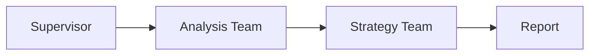
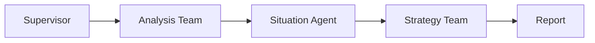
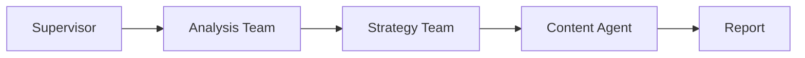

# 📊 그래프 동작 구조 상세 설명

## 1. 전체 흐름도

```
사용자 입력
  ↓
START
  ↓
┌─────────────────┐
│   supervisor    │ ← 최상위 감독자 (라우팅)
└─────────────────┘
  ↓
  ├─ stp_output 없음? ─→ market_analysis_team (서브그래프)
  │                         ├─ segmentation_agent
  │                         ├─ targeting_agent
  │                         └─ positioning_agent
  │                         ↓
  │                      supervisor로 복귀
  │
  ├─ strategy_cards 없음? ─→ strategy_planning_team (서브그래프)
  │                            ├─ stp_validation_agent (+ 4P 데이터 매핑)
  │                            ├─ strategy_4p_agent
  │                            └─ execution_plan_agent
  │                            ↓
  │                         supervisor로 복귀
  │
  └─ task_type 분기 ─→ 최종 보고서 생성
      │
      ├─ [종합_전략_수립] ─→ generate_comprehensive_report ─→ END
      ├─ [상황_전술_제안] ─→ generate_tactical_card ─→ END
      └─ [콘텐츠_생성_가이드] ─→ generate_content_guide ─→ END
```

## 2. 노드 목록 및 역할

### 메인 그래프 노드

| 노드명 | 역할 | 입력 | 출력 |
|--------|------|------|------|
| `supervisor` | 최상위 라우팅 | SupervisorState | next 경로 결정 |
| `market_analysis_team` | STP 분석 서브그래프 실행 | store_id, store_name | stp_output, store_raw_data |
| `strategy_planning_team` | 전략 수립 서브그래프 실행 | stp_output, task_type | strategy_cards, execution_plan |
| `generate_comprehensive_report` | 종합 보고서 생성 | 모든 결과 | final_report |
| `generate_tactical_card` | 전술 카드 생성 | 모든 결과 + 상황 정보 | tactical_card |
| `generate_content_guide` | 콘텐츠 가이드 생성 | 모든 결과 + 채널 정보 | content_guide |

### Market Analysis Team (서브그래프)

```
segmentation_agent
  ↓ (업종별 클러스터 분석, PC축 해석)
targeting_agent
  ↓ (가맹점 위치 파악, 타겟 군집 선정)
positioning_agent
  ↓ (경쟁자 분석, White Space 탐지)
```

### Strategy Planning Team (서브그래프)

```
stp_validation_agent
  ↓ (STP 검증 + 🔥 4P 데이터 매핑)
strategy_4p_agent
  ↓ (3가지 대안 전략 생성)
execution_plan_agent
  ↓ (4주간 실행 계획)
```

## 3. supervisor 라우팅 로직

```python
def top_supervisor_node(state):
    task_type = state['task_type']

    # 1단계: STP 분석 필요?
    if not state.get('stp_output'):
        return "market_analysis_team"

    # 2단계: 전략 수립 필요?
    if not state.get('strategy_cards'):
        return "strategy_planning_team"

    # 3단계: 최종 보고서 (task_type별 분기)
    if task_type == "종합_전략_수립":
        return "generate_comprehensive_report"
    elif task_type == "상황_전술_제안":
        return "generate_tactical_card"
    elif task_type == "콘텐츠_생성_가이드":
        return "generate_content_guide"
```

## 4. State 전이 과정

### 초기 State
```python
{
    "target_store_id": "16184E93D9",
    "target_store_name": "성우축산",
    "task_type": "종합_전략_수립",
    "stp_output": None,          # ← 아직 없음
    "strategy_cards": [],         # ← 아직 없음
    "final_report": ""
}
```

### 1단계 후 (market_analysis_team 실행)
```python
{
    ...
    "stp_output": {              # ← ✅ 생성됨!
        "cluster_profiles": [
            {"cluster_id": "Cluster 1", "pc1_mean": 1.5, ...},
            {"cluster_id": "Cluster 2", "pc1_mean": -0.8, ...}
        ],
        "store_current_position": {
            "store_id": "16184E93D9",
            "pc1_score": 1.77,
            "pc2_score": -1.47,
            "cluster_name": "Cluster_2_High_Safe"
        },
        "nearby_competitors": [
            {"store_name": "대보축산", "distance": 0.23},
            ...
        ]
    },
    "store_raw_data": {...}
}
```

### 2단계 후 (strategy_planning_team 실행)
```python
{
    ...
    "strategy_cards": [          # ← ✅ 생성됨!
        {
            "card_id": 1,
            "title": "데이터 기반 전략 1",
            "positioning_concept": "차별화 메시지 1",
            "strategy_4p": {
                "product": "제품 전략...",
                "price": "가격 전략...",
                "place": "유통 전략...",
                "promotion": "프로모션 전략..."
            },
            "priority": "High",
            "data_evidence": [
                "PC1: 매출 vs 성장",
                "PC2: 경쟁 vs 안정",
                "근접 경쟁자: 10개",
                "Product: 배달 매출 비중 65%",
                "Price: 객단가 15,000원"
            ]
        },
        {...전략 2...},
        {...전략 3...}
    ],
    "selected_strategy": {...전략 1...},
    "execution_plan": "## 1주차: ..."
}
```

### 최종 State (보고서 생성 후)
```python
{
    ...
    "final_report": """
    # 📊 마케팅 종합 전략 보고서

    ## 1. 가맹점 개요
    - 이름: 성우축산
    - 업종: 축산물
    - 현재 위치: PC1=1.77, PC2=-1.47

    ## 2. STP 분석
    ...
    """
}
```

## 5. 작업 유형별 출력

### 🔹 종합_전략_수립
- **경로**: Market Team → Strategy Team → `generate_comprehensive_report`
- **출력**: 경영진용 종합 컨설팅 보고서
- **내용**: STP 분석 + 4P 전략 + 실행 계획 + 데이터 근거

### ⚡ 상황_전술_제안
- **경로**: Market Team → Strategy Team → `generate_tactical_card`
- **출력**: 즉시 실행 전술 카드
- **내용**:
  - 핵심 액션 Top 3
  - 예상 예산
  - 실행 타임라인 (D-Day, D+3, D+7)
  - 상황 정보 반영 (상권, 기간)

### 📱 콘텐츠_생성_가이드
- **경로**: Market Team → Strategy Team → `generate_content_guide`
- **출력**: SNS 콘텐츠 실행 가이드
- **내용**:
  - 인스타그램: 카피 예시, 해시태그
  - 네이버 블로그: 제목, SEO 키워드
  - 페이스북: 이벤트 아이디어

## 6. 엣지(Edge) 구조

### 기본 엣지
```python
START → supervisor
market_analysis_team → supervisor  (복귀)
strategy_planning_team → supervisor  (복귀)
```

### 조건부 엣지 (supervisor에서)
```python
supervisor → {
    "market_analysis_team",          # stp_output 없을 때
    "strategy_planning_team",        # strategy_cards 없을 때
    "generate_comprehensive_report", # 종합_전략_수립
    "generate_tactical_card",        # 상황_전술_제안
    "generate_content_guide",        # 콘텐츠_생성_가이드
    END                              # 모든 완료
}
```

### 종료 엣지
```python
generate_comprehensive_report → END
generate_tactical_card → END
generate_content_guide → END
```

## 7. 서브그래프 내부 구조

### Market Analysis Team
```python
workflow = StateGraph(MarketAnalysisState)

workflow.add_node("segmentation_agent", segmentation_agent)
workflow.add_node("targeting_agent", targeting_agent)
workflow.add_node("positioning_agent", positioning_agent)

workflow.add_edge(START, "segmentation_agent")
workflow.add_edge("segmentation_agent", "targeting_agent")
workflow.add_edge("targeting_agent", "positioning_agent")
workflow.add_edge("positioning_agent", END)
```

### Strategy Planning Team
```python
workflow = StateGraph(StrategyPlanningState)

workflow.add_node("stp_validation_agent", stp_validation_agent)
workflow.add_node("strategy_4p_agent", strategy_4p_agent)
workflow.add_node("execution_plan_agent", execution_plan_agent)

workflow.add_edge(START, "stp_validation_agent")
workflow.add_edge("stp_validation_agent", "strategy_4p_agent")
workflow.add_edge("strategy_4p_agent", "execution_plan_agent")
workflow.add_edge("execution_plan_agent", END)
```

## 8. 테스트 시나리오

### 시나리오 1: 종합_전략_수립
```
1. supervisor → market_analysis_team
   - segmentation: 축산물 업종 클러스터 2개 발견
   - targeting: 성우축산 = Cluster_2
   - positioning: 경쟁자 10개, White Space 1개

2. supervisor → strategy_planning_team
   - stp_validation: STP 검증 + 4P 데이터 매핑
   - strategy_4p: 3가지 전략 생성
   - execution_plan: 4주 계획

3. supervisor → generate_comprehensive_report
   - 종합 보고서 작성

4. END
```

### 시나리오 2: 상황_전술_제안
```
1~2. (동일)

3. supervisor → generate_tactical_card
   - 상황 정보 (성수동, 2025-01-01~07) 반영
   - 즉시 실행 전술 카드 생성

4. END
```

### 시나리오 3: 콘텐츠_생성_가이드
```
1~2. (동일)

3. supervisor → generate_content_guide
   - 채널별 콘텐츠 전략
   - 카피, 해시태그, 이벤트 생성

4. END
```

## 9. 핵심 특징

✅ **계층적 구조**: 메인 그래프 → 서브그래프 (2단계)
✅ **상태 기반 라우팅**: supervisor가 state를 보고 다음 노드 결정
✅ **재사용 가능**: Market/Strategy Team은 모든 task_type에서 공통 사용
✅ **유연한 출력**: 마지막 보고서만 task_type에 따라 다름
✅ **데이터 기반**: 실제 CSV 데이터 + PCA + K-Means 결과 활용

## 10. 실행 예시 (로그)

```
🚀 Marketing MultiAgent System V2
⏰ 시작: 2025-10-24 12:00:00

[Supervisor] 작업 유형: 종합_전략_수립
[Supervisor] → Market Analysis Team

[Segmentation] 시장 군집 분석 중...
✅ STP 데이터 로드 완료
[Targeting] 타겟 군집 선정 중...
[Positioning] 차별화 포지션 탐색 중...
[Market Team] 완료

[Supervisor] 작업 유형: 종합_전략_수립
[Supervisor] → Strategy Planning Team

[STP Validation] STP 분석 결과 검증 중...
   📊 가맹점 데이터를 4P 전략에 매핑 중...
   ✓ 4P 데이터 매핑 완료
[4P Strategy] 데이터 기반 3개 전략 카드 생성 중...
[Execution Plan] 실행 계획 수립 중...
[Strategy Team] 완료 - 카드 3개

[Supervisor] 작업 유형: 종합_전략_수립
[Supervisor] → 종합 보고서 생성
[Report] 종합 전략 보고서 생성 중...

✅ 완료 - 소요시간: 45.23초
```
# Marketing MultiAgent System - Final Version

## 📋 개요

**3가지 작업 유형**을 지원하는 통합 마케팅 자동화 시스템입니다.

### 작업 유형

1. **종합_전략_수립** 📊
   - 기존 STP 분석 + 4P 전략
   - 종합 컨설팅 보고서
   - Market Analysis Team → Strategy Team

2. **상황_전술_제안** ⚡
   - Situation Agent 우선 (이벤트/날씨)
   - 즉시 실행 전술 카드
   - 단기 대응 전략

3. **콘텐츠_생성_가이드** 📱
   - Content Agent 활성화
   - 채널별 콘텐츠 가이드
   - 카피 예시 + 해시태그

---

## 🏗️ 아키텍처

```
사용자 입력
  │
  ├─ 가맹점 선택
  ├─ 작업 유형 선택 (종합/상황/콘텐츠)
  └─ 추가 정보 (상황/채널)
  │
  ▼
Top-Level Supervisor (라우팅)
  │
  ├─ [종합] → Analysis Team → Strategy Team → 보고서
  ├─ [상황] → Analysis Team → Situation Agent → Strategy Team → 전술
  └─ [콘텐츠] → Analysis Team → Strategy Team → Content Agent → 가이드
```

---

## 🚀 실행 방법

### 1. 환경 설정

```bash
# 패키지 설치
pip install -r requirements_situation_content.txt

# .env 파일 생성
echo "GOOGLE_API_KEY=your_gemini_key" > .env
echo "TAVILY_API_KEY=your_tavily_key" >> .env
```

### 2. Streamlit UI 실행

```bash
streamlit run streamlit_app_final.py
```

### 3. CLI 실행

```python
from marketing_multiagent_system_final import run_marketing_strategy_system

# 종합 전략
result = run_marketing_strategy_system(
    target_store_id="TEST001",
    target_store_name="테스트 카페",
    task_type="종합_전략_수립"
)

# 상황 전술
result = run_marketing_strategy_system(
    target_store_id="TEST001",
    target_store_name="테스트 카페",
    task_type="상황_전술_제안",
    target_market_id="M45",
    period_start="2025-11-01",
    period_end="2025-11-07"
)

# 콘텐츠 가이드
result = run_marketing_strategy_system(
    target_store_id="TEST001",
    target_store_name="테스트 카페",
    task_type="콘텐츠_생성_가이드"
)
```

---

## 📂 파일 구조

```
/home/claude/
├── marketing_multiagent_system_final.py  # 메인 시스템 (통합)
├── streamlit_app_final.py                # Streamlit UI (통합)
├── agents/
│   ├── situation_agent.py                # Situation Agent
│   └── content_agent.py                  # Content Agent
├── tools/
│   ├── tavily_events.py                  # 이벤트 수집 Tool
│   └── weather_signals.py                # 날씨 분석 Tool
├── workflows/
│   └── integrated_workflow.py            # Langgraph 워크플로우
├── requirements_situation_content.txt
└── README_FINAL_INTEGRATED.md
```

---

## 🎯 작업 유형별 상세

### 1. 종합_전략_수립 📊

**입력**:
- 가맹점 ID
- 가맹점명

**프로세스**:
1. Segmentation: 시장 군집 분석
2. Targeting: 타겟 군집 선정
3. Positioning: White Space 탐지
4. Strategy: 4P 전략 수립
5. Content: 실행 계획 생성

**출력**:
- STP 분석 결과
- 4P 전략
- 실행 계획
- 종합 보고서

**UI (4개 탭)**:
- Tab 1: STP 분석
- Tab 2: 전략 수립
- Tab 3: 실행 계획
- Tab 4: 최종 보고서

---

### 2. 상황_전술_제안 ⚡

**입력**:
- 가맹점 ID
- 가맹점명
- 상권 ID (예: M45)
- 기간 (시작일~종료일)

**프로세스**:
1. Analysis Team: STP 분석
2. **Situation Agent**: 이벤트/날씨 수집 (병렬)
   - Tavily: 지역 이벤트
   - Open-Meteo: 날씨 예보
3. Strategy: 상황 우선 전술 수립
4. Content: 긴급 실행 계획

**출력**:
- Situation JSON (신호 + 출처)
- 즉시 실행 전술
- 단기 보고서

**UI (2개 탭)**:
- Tab 1: 상황 분석 (신호 카드)
- Tab 2: 즉시 전술

---

### 3. 콘텐츠_생성_가이드 📱

**입력**:
- 가맹점 ID
- 가맹점명

**프로세스**:
1. Analysis Team: STP 분석
2. Strategy: 콘텐츠 중심 4P
3. **Content Agent**: 채널별 가이드 생성
   - 인스타그램
   - 네이버 블로그
   - 기타 채널

**출력**:
- ContentGuide JSON
- 채널별 포스팅 형식
- 카피 예시 3개
- 해시태그 리스트
- 무드보드

**UI (2개 탭)**:
- Tab 1: 콘텐츠 가이드 (채널 카드)
- Tab 2: 보고서

---

## 🔄 Workflow 흐름

### 종합 전략 수립



### 상황 전술 제안



### 콘텐츠 생성 가이드



---

## 🧪 테스트

### 단위 테스트

```bash
# Situation Agent
python agents/situation_agent.py

# Content Agent
python agents/content_agent.py

# 전체 시스템
python marketing_multiagent_system_final.py
```

### Streamlit 테스트

```bash
streamlit run streamlit_app_final.py
```

---

## 🔧 커스터마이징

### 1. 작업 유형 추가

`marketing_multiagent_system_final.py`:

```python
# State 정의에 추가
task_type: Literal["종합_전략_수립", "상황_전술_제안", "콘텐츠_생성_가이드", "새_유형"]

# Supervisor 라우팅 추가
if task_type == "새_유형":
    state['next'] = "새_노드"
```

### 2. 지역 추가

`agents/situation_agent.py`:

```python
def default_market_locator(mid: str):
    MARKET_COORDS = {
        "M45": (37.5446, 127.0559, "성수동"),
        "NEW": (위도, 경도, "신규지역"),
    }
```

### 3. 콘텐츠 채널 추가

`agents/content_agent.py`:

```python
# 프롬프트에 채널 추가
user_prompt += """
채널 포함: 인스타그램, 블로그, 유튜브, 틱톡
"""
```

---

## 📈 성능

### 응답 시간

- **종합 전략**: 20-30초
  - Analysis Team: 10-15초
  - Strategy Team: 10-15초
  
- **상황 전술**: 25-35초
  - Analysis Team: 10-15초
  - Situation Agent: 3-5초 (병렬)
  - Strategy Team: 10-15초
  
- **콘텐츠 가이드**: 30-40초
  - Analysis Team: 10-15초
  - Strategy Team: 10-15초
  - Content Agent: 10-15초

### 최적화

1. **캐싱**: Streamlit `@st.cache_data` 활용
2. **병렬 처리**: Situation Agent의 ThreadPoolExecutor
3. **데이터 경량화**: 필수 컬럼만 로드
