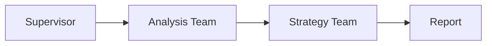
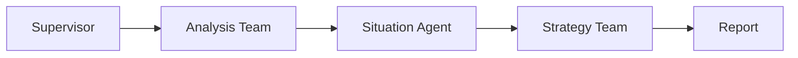
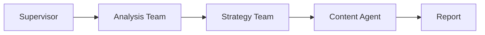

# Marketing MultiAgent System - Final Version

## 📋 개요

**3가지 작업 유형**을 지원하는 통합 마케팅 자동화 시스템입니다.

### 작업 유형

1. **종합_전략_수립** 📊
   - 기존 STP 분석 + 4P 전략
   - 종합 컨설팅 보고서
   - Market Analysis Team → Strategy Team

2. **상황_전술_제안** ⚡
   - Situation Agent 우선 (이벤트/날씨)
   - 즉시 실행 전술 카드
   - 단기 대응 전략

3. **콘텐츠_생성_가이드** 📱
   - Content Agent 활성화
   - 채널별 콘텐츠 가이드
   - 카피 예시 + 해시태그

---

## 🏗️ 아키텍처

```
사용자 입력
  │
  ├─ 가맹점 선택
  ├─ 작업 유형 선택 (종합/상황/콘텐츠)
  └─ 추가 정보 (상황/채널)
  │
  ▼
Top-Level Supervisor (라우팅)
  │
  ├─ [종합] → Analysis Team → Strategy Team → 보고서
  ├─ [상황] → Analysis Team → Situation Agent → Strategy Team → 전술
  └─ [콘텐츠] → Analysis Team → Strategy Team → Content Agent → 가이드
```

---

## 🚀 실행 방법

### 1. 환경 설정

```bash
# 패키지 설치
pip install -r requirements_situation_content.txt

# .env 파일 생성
echo "GOOGLE_API_KEY=your_gemini_key" > .env
echo "TAVILY_API_KEY=your_tavily_key" >> .env
```

### 2. Streamlit UI 실행

```bash
streamlit run streamlit_app_final.py
```

### 3. CLI 실행

```python
from marketing_multiagent_system_final import run_marketing_strategy_system

# 종합 전략
result = run_marketing_strategy_system(
    target_store_id="TEST001",
    target_store_name="테스트 카페",
    task_type="종합_전략_수립"
)

# 상황 전술
result = run_marketing_strategy_system(
    target_store_id="TEST001",
    target_store_name="테스트 카페",
    task_type="상황_전술_제안",
    target_market_id="M45",
    period_start="2025-11-01",
    period_end="2025-11-07"
)

# 콘텐츠 가이드
result = run_marketing_strategy_system(
    target_store_id="TEST001",
    target_store_name="테스트 카페",
    task_type="콘텐츠_생성_가이드"
)
```

---

## 📂 파일 구조

```
/home/claude/
├── marketing_multiagent_system_final.py  # 메인 시스템 (통합)
├── streamlit_app_final.py                # Streamlit UI (통합)
├── agents/
│   ├── situation_agent.py                # Situation Agent
│   └── content_agent.py                  # Content Agent
├── tools/
│   ├── tavily_events.py                  # 이벤트 수집 Tool
│   └── weather_signals.py                # 날씨 분석 Tool
├── workflows/
│   └── integrated_workflow.py            # Langgraph 워크플로우
├── requirements_situation_content.txt
└── README_FINAL_INTEGRATED.md
```

---

## 🎯 작업 유형별 상세

### 1. 종합_전략_수립 📊

**입력**:
- 가맹점 ID
- 가맹점명

**프로세스**:
1. Segmentation: 시장 군집 분석
2. Targeting: 타겟 군집 선정
3. Positioning: White Space 탐지
4. Strategy: 4P 전략 수립
5. Content: 실행 계획 생성

**출력**:
- STP 분석 결과
- 4P 전략
- 실행 계획
- 종합 보고서

**UI (4개 탭)**:
- Tab 1: STP 분석
- Tab 2: 전략 수립
- Tab 3: 실행 계획
- Tab 4: 최종 보고서

---

### 2. 상황_전술_제안 ⚡

**입력**:
- 가맹점 ID
- 가맹점명
- 상권 ID (예: M45)
- 기간 (시작일~종료일)

**프로세스**:
1. Analysis Team: STP 분석
2. **Situation Agent**: 이벤트/날씨 수집 (병렬)
   - Tavily: 지역 이벤트
   - Open-Meteo: 날씨 예보
3. Strategy: 상황 우선 전술 수립
4. Content: 긴급 실행 계획

**출력**:
- Situation JSON (신호 + 출처)
- 즉시 실행 전술
- 단기 보고서

**UI (2개 탭)**:
- Tab 1: 상황 분석 (신호 카드)
- Tab 2: 즉시 전술

---

### 3. 콘텐츠_생성_가이드 📱

**입력**:
- 가맹점 ID
- 가맹점명

**프로세스**:
1. Analysis Team: STP 분석
2. Strategy: 콘텐츠 중심 4P
3. **Content Agent**: 채널별 가이드 생성
   - 인스타그램
   - 네이버 블로그
   - 기타 채널

**출력**:
- ContentGuide JSON
- 채널별 포스팅 형식
- 카피 예시 3개
- 해시태그 리스트
- 무드보드

**UI (2개 탭)**:
- Tab 1: 콘텐츠 가이드 (채널 카드)
- Tab 2: 보고서

---

## 🔄 Workflow 흐름

### 종합 전략 수립



### 상황 전술 제안



### 콘텐츠 생성 가이드



---

## 🧪 테스트

### 단위 테스트

```bash
# Situation Agent
python agents/situation_agent.py

# Content Agent
python agents/content_agent.py

# 전체 시스템
python marketing_multiagent_system_final.py
```

### Streamlit 테스트

```bash
streamlit run streamlit_app_final.py
```

---

## 🔧 커스터마이징

### 1. 작업 유형 추가

`marketing_multiagent_system_final.py`:

```python
# State 정의에 추가
task_type: Literal["종합_전략_수립", "상황_전술_제안", "콘텐츠_생성_가이드", "새_유형"]

# Supervisor 라우팅 추가
if task_type == "새_유형":
    state['next'] = "새_노드"
```

### 2. 지역 추가

`agents/situation_agent.py`:

```python
def default_market_locator(mid: str):
    MARKET_COORDS = {
        "M45": (37.5446, 127.0559, "성수동"),
        "NEW": (위도, 경도, "신규지역"),
    }
```

### 3. 콘텐츠 채널 추가

`agents/content_agent.py`:

```python
# 프롬프트에 채널 추가
user_prompt += """
채널 포함: 인스타그램, 블로그, 유튜브, 틱톡
"""
```

---

## 📈 성능

### 응답 시간

- **종합 전략**: 20-30초
  - Analysis Team: 10-15초
  - Strategy Team: 10-15초
  
- **상황 전술**: 25-35초
  - Analysis Team: 10-15초
  - Situation Agent: 3-5초 (병렬)
  - Strategy Team: 10-15초
  
- **콘텐츠 가이드**: 30-40초
  - Analysis Team: 10-15초
  - Strategy Team: 10-15초
  - Content Agent: 10-15초

### 최적화

1. **캐싱**: Streamlit `@st.cache_data` 활용
2. **병렬 처리**: Situation Agent의 ThreadPoolExecutor
3. **데이터 경량화**: 필수 컬럼만 로드

---

## 🐛 문제 해결

### Q1. 데이터 로드 실패

```
FileNotFoundError: data/df_final.csv
```

**해결**: `DATA_DIR` 경로 확인

```python
DATA_DIR = "/mnt/project"  # 실제 경로로 수정
```

### Q2. Situation Agent 타임아웃

```
requests.exceptions.Timeout
```

**해결**: `weather_signals.py`에서 timeout 증가

```python
r = requests.get(..., timeout=60)
```

### Q3. Content Agent JSON 파싱 실패

**해결**: Fallback 가이드 자동 적용됨 (시스템 내장)

---

## 🔮 향후 확장

### Phase 1 (완료) ✅
- 3가지 작업 유형 통합
- Situation Agent (이벤트/날씨)
- Content Agent (채널 가이드)
- Streamlit UI (작업 유형별)

### Phase 2 (계획)
- [ ] 전략 카드 생성 (StrategyCard 모델)
- [ ] 실제 이미지 생성 (AI 이미지)
- [ ] A/B 테스트 기능

### Phase 3 (계획)
- [ ] 다국어 지원
- [ ] 업종별 템플릿 확장
- [ ] 성과 추적 (GA4)

---

## 📞 지원

- GitHub Issues: 버그 리포트
- Email: support@marketing-ai.com

---

**버전**: 2.0.0 (Final Integrated)  
**최종 업데이트**: 2025-10-24  
**라이선스**: MIT
