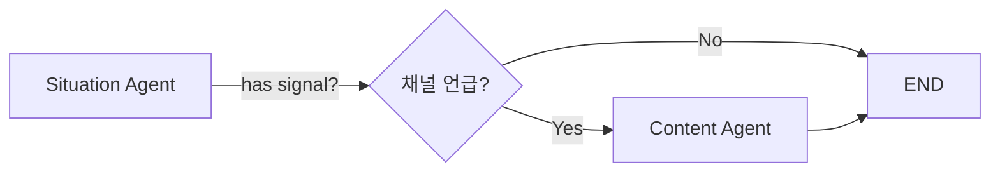

# Situation + Content Agent 구현

## 📋 개요

**Situation Agent**와 **Content Agent**를 통합한 마케팅 자동화 시스템입니다.

### 주요 기능

1. **Situation Agent** 🔍
   - Tavily: 지역 이벤트/팝업스토어 수집
   - Open-Meteo: 날씨 예보 분석
   - 병렬 처리로 빠른 응답

2. **Content Agent** 📱
   - 채널별 콘텐츠 가이드라인 생성
   - 실행 가능한 카피 예시
   - 해시태그 전략 + 무드보드

---

## 🚀 빠른 시작

### 1. 환경 설정

```bash
# 가상환경 생성
python -m venv venv
source venv/bin/activate  # Windows: venv\Scripts\activate

# 패키지 설치
pip install -r requirements_situation_content.txt
```

### 2. API 키 설정

`.env` 파일 생성:

```bash
# Gemini API (필수)
GOOGLE_API_KEY=your_gemini_api_key

# Tavily API (필수)
TAVILY_API_KEY=your_tavily_api_key

# 로그 레벨 (선택)
TAVILY_EVENTS_LOG=WARNING
```

### 3. Streamlit UI 실행

```bash
streamlit run streamlit_situation_content.py
```

브라우저에서 http://localhost:8501 접속

---

## 📂 파일 구조

```
/home/claude/
├── agents/
│   ├── situation_agent.py      # Situation Agent (이벤트+날씨)
│   └── content_agent.py         # Content Agent (콘텐츠 가이드)
├── tools/
│   ├── tavily_events.py         # Tavily 이벤트 Tool
│   └── weather_signals.py       # Open-Meteo 날씨 Tool
├── workflows/
│   └── integrated_workflow.py   # Langgraph 워크플로우
├── streamlit_situation_content.py  # Streamlit UI
├── requirements_situation_content.txt
└── README.md
```

---

## 🎯 Situation Agent

### 입력 (State)

```python
{
    "target_market_id": "M45",           # 상권 ID
    "period_start": "2025-11-01",        # 시작일
    "period_end": "2025-11-07",          # 종료일
    "messages": [HumanMessage(...)],     # 사용자 질의
}
```

### 출력 (Situation JSON)

```python
{
    "has_valid_signal": True,
    "summary": "성수동 2025-11-01~2025-11-07: 3건의 이벤트 단서 / 우천 신호",
    "signals": [
        {
            "signal_id": "EV-20251101-1",
            "signal_type": "event",
            "description": "성수동 팝업스토어",
            "details": {...},
            "relevance": 0.75,
            "valid": True,
            "reason": "지역/기간 키워드 매칭"
        }
    ],
    "citations": ["https://..."],
    "assumptions": ["타이틀/스니펫 기반 1차 정규화"],
    "contract_version": "situation.v2"
}
```

### 특징

- ✅ **병렬 처리**: 이벤트/날씨 동시 수집 (ThreadPoolExecutor)
- ✅ **하위호환**: 기존 state 구조 지원
- ✅ **에러 안전**: Tool 실패 시 빈 결과로 대체

---

## 📱 Content Agent

### 입력 (State)

```python
{
    "target_store_name": "성수 브런치 카페",
    "strategy_4p": {
        "promotion": "인스타그램 릴스 + 네이버 블로그"
    },
    "targeting_positioning": "직장인 밀집 지역",
    "situation": {...}  # Situation Agent 출력
}
```

### 출력 (ContentGuide)

```python
{
    "target_audience": "2030 직장인 여성",
    "brand_tone": "친근하고 활기찬",
    "mood_board": ["밝고 경쾌한", "음식 클로즈업"],
    "channels": [
        {
            "channel_name": "인스타그램",
            "post_format": "릴스 + 피드",
            "visual_direction": [...],
            "copy_examples": [
                "런치 타임 특별 메뉴!",
                "오늘만 이 가격!",
                ...
            ],
            "hashtags": ["#성수카페", "#런치맛집"],
            "posting_frequency": "주 3-4회",
            "best_time": "평일 12시, 18시",
            "content_tips": [...]
        }
    ],
    "overall_strategy": "일상적 매력을 SNS로 전달",
    "do_not_list": ["과도한 할인 강조"]
}
```

### 특징

- ✅ **채널 맞춤**: 인스타그램 vs 블로그 차별화
- ✅ **실행 가능**: 구체적 카피 예시 제공
- ✅ **시각 가이드**: 무드보드 + 촬영 방향
- ✅ **Fallback**: LLM 실패 시 기본 가이드 제공

---

## 🔄 Workflow

### Langgraph 흐름



### 조건부 라우팅

```python
def route_after_situation(state):
    """
    Promotion에 채널 키워드가 있으면 Content Agent 실행
    """
    promotion = state.get("strategy_4p", {}).get("promotion", "")
    channel_keywords = ["인스타", "블로그", "페이스북", ...]
    
    if any(kw in promotion for kw in channel_keywords):
        return "content_agent"
    else:
        return END
```

---

## 🧪 테스트

### 1. Situation Agent 단독 테스트

```bash
cd /home/claude
python agents/situation_agent.py
```

### 2. Content Agent 단독 테스트

```bash
python agents/content_agent.py
```

### 3. 통합 Workflow 테스트

```bash
python workflows/integrated_workflow.py
```

### 4. Streamlit UI 테스트

```bash
streamlit run streamlit_situation_content.py
```

---

## 📊 Streamlit UI 구성

### Tab 1: 상황 분석 📡

- **요약 카드**: 전체 신호 요약
- **신호 카드**: 이벤트/날씨별 상세 정보
- **출처**: Tavily URL + Open-Meteo API
- **가정사항**: 데이터 해석 전제

### Tab 2: 콘텐츠 가이드 📱

- **전체 전략**: 브랜드 톤 + 무드보드
- **채널별 카드**:
  - 포스팅 형식
  - 시각적 방향
  - 카피 예시 (강조 박스)
  - 해시태그 (칩 스타일)
  - 게시 빈도/시간
  - 실행 팁
- **금기 사항**: 피해야 할 표현

---

## 🔧 커스터마이징

### 1. 지역 좌표 추가

`agents/situation_agent.py`:

```python
def default_market_locator(mid: str):
    MARKET_COORDS = {
        "M45": (37.5446, 127.0559, "성수동"),
        "NEW_ID": (위도, 경도, "지역명"),  # 추가
    }
    return MARKET_COORDS.get(mid, (37.5665, 126.9780, "서울"))
```

### 2. 채널 템플릿 추가

`agents/content_agent.py`:

```python
def generate_youtube_template(guide: ChannelGuideline) -> str:
    """유튜브 쇼츠 템플릿"""
    return f"""
📹 YouTube Shorts 가이드
- 길이: 15-60초
- 핵심: 첫 3초에 훅
- 자막: 필수
...
"""
```

### 3. LLM 프롬프트 조정

`agents/content_agent.py`:

```python
system_prompt = f"""
당신은 소상공인을 위한 콘텐츠 크리에이터입니다.

**추가 원칙:**
- 예산 제약 고려 (무료 도구 우선)
- 촬영 난이도 낮게
- 텍스트 중심 콘텐츠 포함
"""
```

---

## 🐛 문제 해결

### Q1. Tavily API 에러

```
TavilyAPIError: Invalid API key
```

**해결**: `.env` 파일에 `TAVILY_API_KEY` 확인

### Q2. Open-Meteo 타임아웃

```
requests.exceptions.Timeout
```

**해결**: `weather_signals.py`에서 `timeout=30` → `timeout=60` 증가

### Q3. Gemini JSON 파싱 실패

```
json.JSONDecodeError: Expecting value
```

**해결**: Content Agent에 Fallback 가이드 적용됨 (자동 처리)

### Q4. Streamlit 포트 충돌

```
OSError: [Errno 48] Address already in use
```

**해결**: 
```bash
streamlit run streamlit_situation_content.py --server.port 8502
```

---

## 📈 성능

### 응답 시간

- **Situation Agent**: 3-5초 (병렬 처리)
  - Tavily: 2-3초
  - Open-Meteo: 1-2초
- **Content Agent**: 5-10초 (Gemini LLM 호출)

### 최적화 팁

1. **캐싱**: Streamlit `@st.cache_data` 활용
2. **배치**: 여러 가맹점 동시 처리
3. **비동기**: `asyncio` 기반 병렬화

---

## 🔮 향후 확장

### Phase 1 (완료) ✅
- Situation Agent (이벤트+날씨)
- Content Agent (기본 가이드)
- Streamlit UI

### Phase 2 (계획)
- [ ] 실제 게시물 생성 (이미지 AI)
- [ ] 성과 추적 (GA4 연동)
- [ ] A/B 테스트 기능

### Phase 3 (계획)
- [ ] 다국어 지원
- [ ] 업종별 템플릿 확장
- [ ] 자동 예약 게시

---

## 📞 지원

문의: GitHub Issues 또는 이메일

---

**버전**: 1.0.0  
**최종 업데이트**: 2025-10-24  
**라이선스**: MIT
