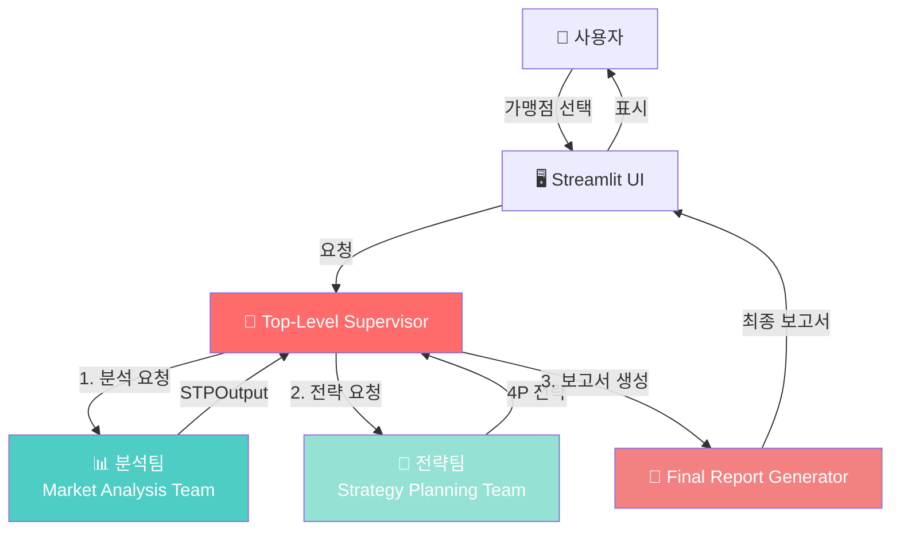
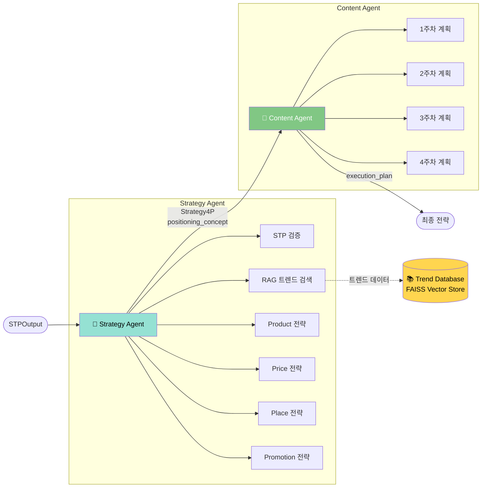
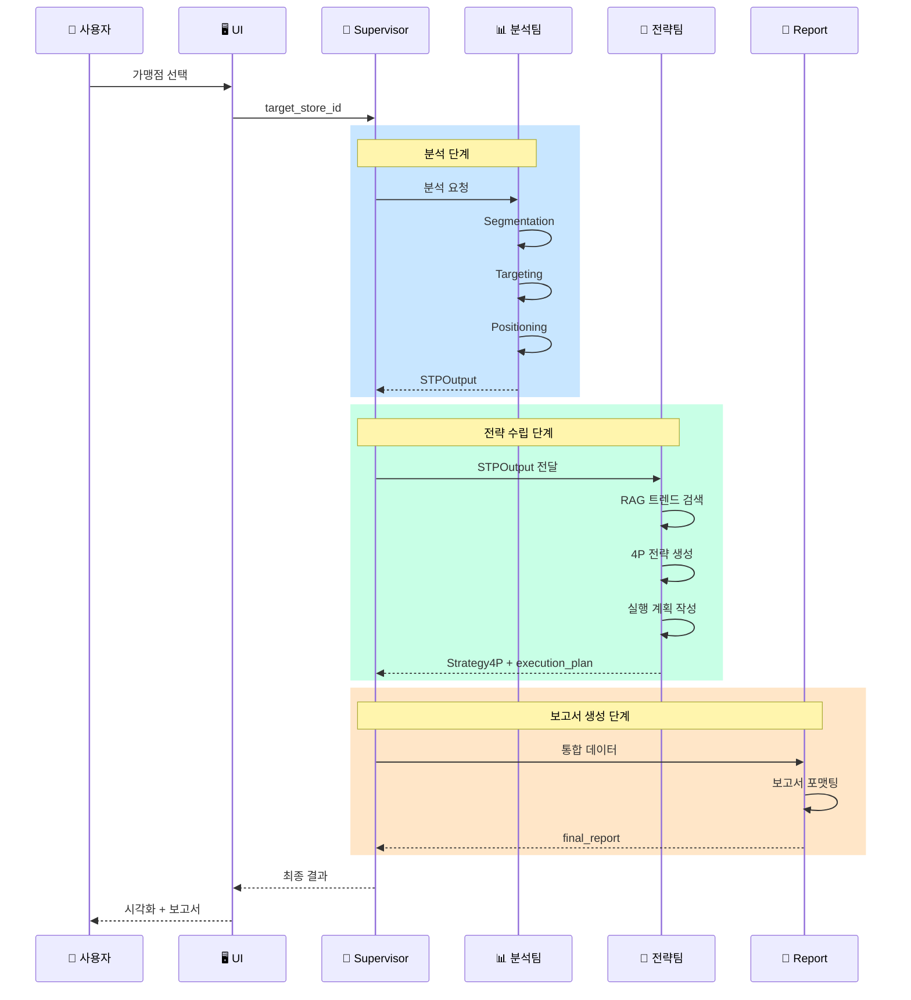
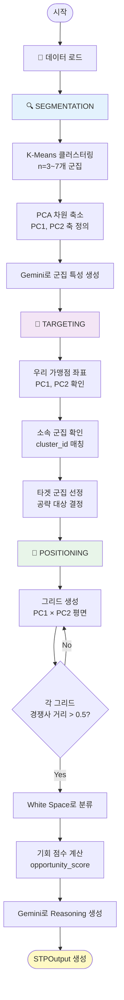
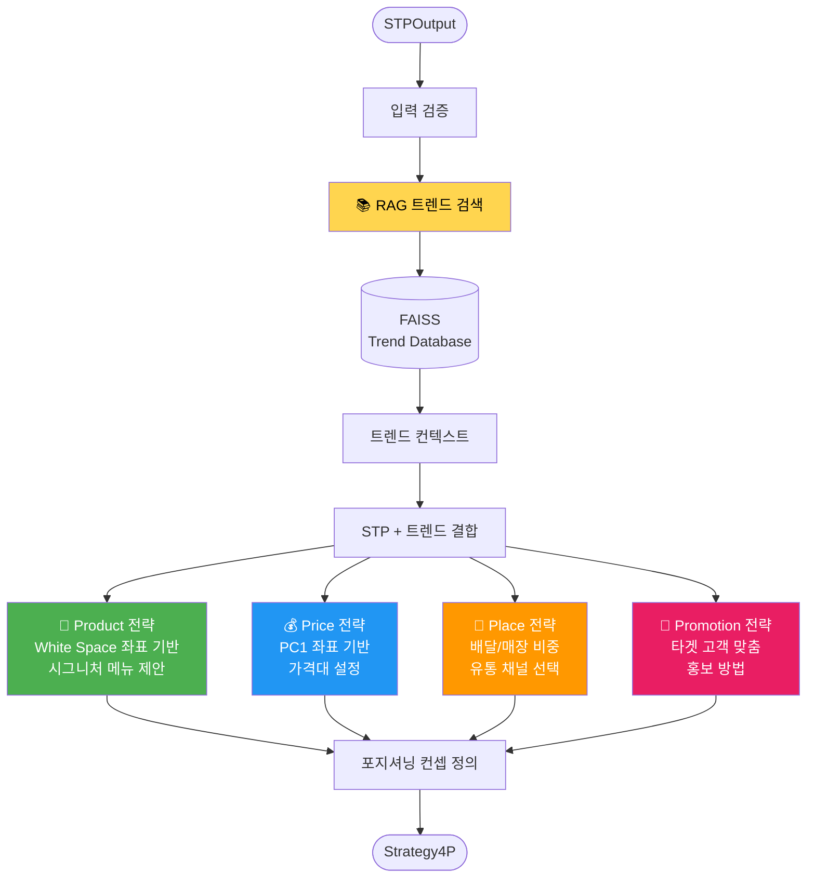
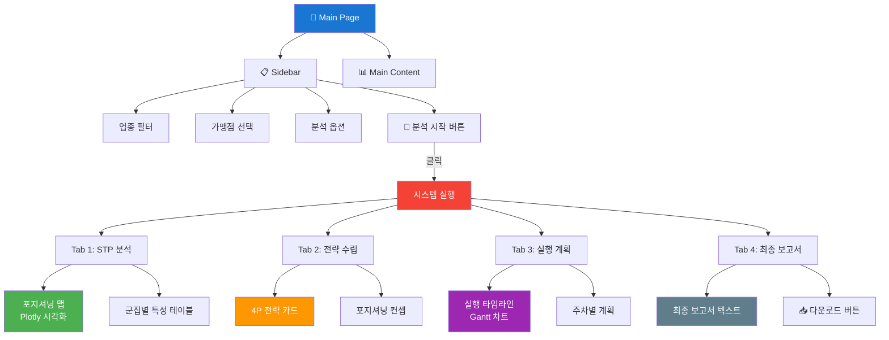
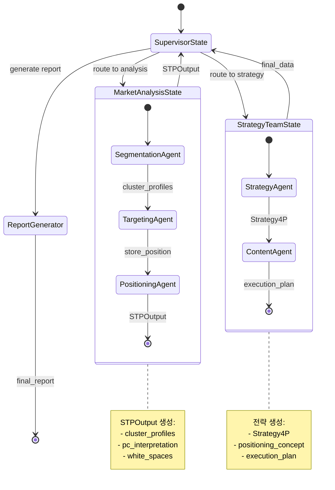
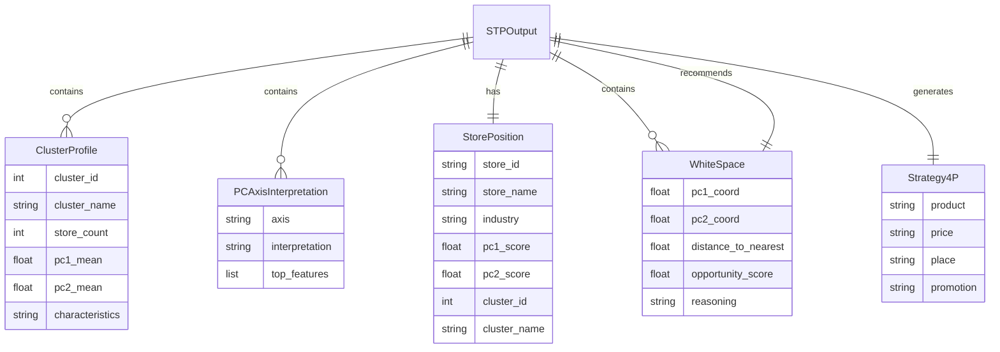
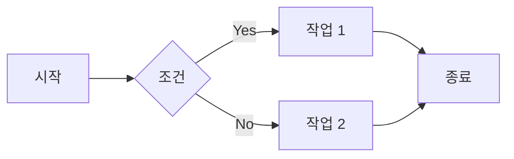

# System Architecture Diagrams
## Marketing MultiAgent System - Visual Guide

---

## 1. 전체 시스템 아키텍처



---

## 2. 분석팀 (Market Analysis Team) 상세 구조

```mermaid
graph LR
    Start([START]) --> Seg[🔍 Segmentation Agent]
    
    Seg -->|ClusterProfile[]<br/>PCAxisInterpretation| Targ[🎯 Targeting Agent]
    
    Targ -->|target_cluster_id<br/>StorePosition| Pos[📍 Positioning Agent]
    
    Pos -->|WhiteSpace[]<br/>recommended_white_space| End([STPOutput])
    
    subgraph "Segmentation"
        Seg --> KMeans[K-Means 클러스터링]
        Seg --> PCA[PCA 축 해석]
        Seg --> LLM1[Gemini 2.5 Pro<br/>특성 생성]
    end
    
    subgraph "Targeting"
        Targ --> Current[현재 포지션 파악]
        Targ --> Target[타겟 군집 선정]
    end
    
    subgraph "Positioning"
        Pos --> Grid[그리드 생성]
        Pos --> Distance[거리 계산]
        Pos --> Score[기회 점수 계산]
        Pos --> LLM2[Gemini 2.5 Pro<br/>Reasoning 생성]
    end
    
    style Seg fill:#4ecdc4,color:#fff
    style Targ fill:#45b7d1,color:#fff
    style Pos fill:#3d9db5,color:#fff
```

---

## 3. 전략팀 (Strategy Planning Team) 상세 구조



---

## 4. 데이터 흐름 (Data Flow)



---

## 5. STP 분석 프로세스



---

## 6. White Space Detection 알고리즘

```mermaid
flowchart LR
    Input[PC1 × PC2 평면] --> Grid[그리드 생성<br/>20×20]
    
    Grid --> Loop{각 그리드 포인트}
    
    Loop --> CalcDist[가장 가까운<br/>경쟁사 거리 계산]
    
    CalcDist --> Check{거리 ≥ 0.5?}
    
    Check -->|No| Loop
    Check -->|Yes| Score[기회 점수 계산<br/>distance × center_factor]
    
    Score --> Add[White Space 리스트에 추가]
    
    Add --> Loop
    
    Loop --> Sort[기회 점수 기준 정렬]
    
    Sort --> Top10[상위 10개 선택]
    
    Top10 --> LLM[Gemini로<br/>각 포지션의<br/>Reasoning 생성]
    
    LLM --> Output([WhiteSpace[] 반환])
    
    style Check fill:#ffeb3b
    style Score fill:#4caf50,color:#fff
    style LLM fill:#2196f3,color:#fff
```

---

## 7. Strategy Agent 4P 전략 생성 프로세스



---

## 8. Streamlit UI 구조



---

## 9. 에이전트 간 State 전달



---

## 10. 데이터 모델 관계도



---

## 사용 방법

### Mermaid 다이어그램 렌더링

1. **GitHub/GitLab**: 마크다운 파일에서 자동 렌더링
2. **VSCode**: Mermaid 확장 프로그램 설치
3. **온라인 에디터**: https://mermaid.live/

### 다이어그램 수정



---

## 참고

- [Mermaid 공식 문서](https://mermaid.js.org/)
- [Mermaid Live Editor](https://mermaid.live/)
